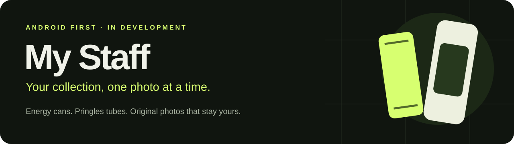
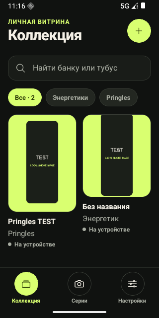
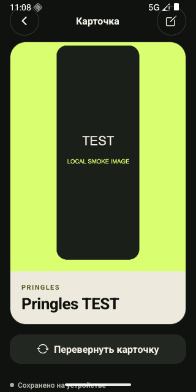
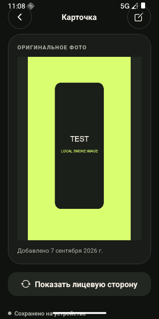
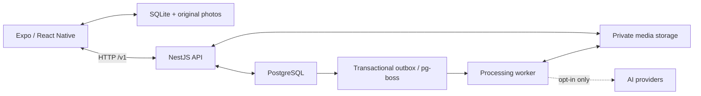

<p align="center">
  
</p>

<p align="center">
  <a href="https://github.com/realfamousbae/my-staff/actions/workflows/verify.yml"></a>
  
  
  
</p>

<p align="center">
  <strong>A personal collection of energy drink cans and Pringles tubes.</strong><br />
  Capture a photo. Keep the original. Build a collection you can take with you.
</p>

<p align="center">
  English · <a href="README.ru.md">Русский</a><br />
  <a href="#try-the-prototype">Try it</a> · <a href="docs/getting-started.md">Set up</a> · <a href="docs/architecture.md">Architecture</a> · <a href="ROADMAP.md">Roadmap</a> · <a href="CONTRIBUTING.md">Contribute</a>
</p>

> [!IMPORTANT]
> **This is an early prototype in active development.** Android is the current test platform; iOS is planned. AI adapters are implemented but disabled by default and have not been evaluated on a real collection. There is no hosted public service or store release. The app is named My Staff and its current interface is in Russian.

## What it does

My Staff turns photographed physical objects into personal collectible cards. A catalog edition describes a product's packaging; a collection item records an individual object you own. An unidentified can can be saved immediately and linked to an edition later.

| Capture                            | Collect                                            | Keep                                          |
| ---------------------------------- | -------------------------------------------------- | --------------------------------------------- |
| Camera, photo picker, extra angles | Energy drinks and Pringles, search, filters, notes | Persistent originals and SQLite on the device |
| A card opens after saving          | Front/back card with the original on the reverse   | Account-based sync to your own API            |
| Optional catalog association       | Soft deletion and restoration                      | ZIP backup and repeatable import              |

**Rarity and social mechanics are deliberately deferred.** The current priority is a dependable collection workflow and a data model that separates personal items, catalog editions, and original photos.

## Inside the prototype

<table>
  <tr>
    <td align="center"></td>
    <td align="center"></td>
    <td align="center"></td>
  </tr>
  <tr><td align="center">Your collection</td><td align="center">A personal card</td><td align="center">The original stays with it</td></tr>
</table>

These are actual Android emulator screenshots using an explicitly labeled **TEST** image. The APK does not ship with a seeded collection or fabricated recognition results.

## Try the prototype

Download the ARM64 APK and SHA-256 file from the [v0.2.0-alpha.1 prerelease](https://github.com/realfamousbae/my-staff/releases/tag/v0.2.0-alpha.1). It runs without Expo Go, Metro, an account, or an AI key. Camera/import, local cards, edits, and backups can be tried offline.

Version 0.2 adds a purple M launcher icon, Android back navigation, and a gallery for original photos and additional angles. Photo import also works without camera permission.

The APK uses a development signing key and is intended for personal testing. Samsung Galaxy S24 Ultra is the target physical device, but the recorded end-to-end verification used an Android API 36 ARM64 emulator. See [verification and limitations](docs/prototype-verification.md).

To use sync, run the local backend and configure its address in the app. There is no shared hosted backend supplied with the download.

## Run locally

Requirements: **Node.js 22**, **pnpm 10.34.5**, and a running **Docker** installation with Compose. Java and the Android SDK are needed only for native builds.

```sh
git clone https://github.com/realfamousbae/my-staff.git
cd my-staff
pnpm install --frozen-lockfile
pnpm setup:local
pnpm dev:backend
```

In another terminal:

```sh
pnpm dev:mobile
```

Use a compatible Expo development client for native development, or install the standalone prerelease APK. [Full setup instructions](docs/getting-started.md) cover device connection, Android builds, environment configuration, and troubleshooting.

| Target                                                       | API URL in the app      |
| ------------------------------------------------------------ | ----------------------- |
| Android Emulator                                             | `http://10.0.2.2:3000`  |
| USB-connected Android, after `adb reverse tcp:3000 tcp:3000` | `http://127.0.0.1:3000` |
| A future remote deployment                                   | Your HTTPS API URL      |

## Architecture



- **Device:** persistent files, SQLite, durable operations, and recovery after interrupted capture.
- **Server:** a modular monolith with separate API and worker processes.
- **Contracts:** shared Zod schemas and TypeScript types; HTTP `/v1` is still evolving.
- **Integrity:** stable operation IDs, optimistic versions, private originals, SHA-256 verification, and input revisions for processing results.

Read the [architecture](docs/architecture.md), [decision records](docs/decisions/README.md), and [API guide](docs/api.md).

## Development commands

```sh
pnpm verify          # Types, tests with local PostgreSQL, server build
pnpm format:check    # Repository formatting
pnpm export:android  # Android JS/Hermes export; not a native device test
pnpm apk:android     # Standalone ARM64 test APK
pnpm clean:cache     # Generated project build caches, after preserving the APK
```

The automated suite has **47 tests**, including real PostgreSQL and Nest HTTP integration tests, S3 SDK checks against a loopback HTTP fixture, and navigation regressions. Native verification additionally covered sync, original-photo checksums, ZIP restoration, repeat import, editing, filters, deletion, and restart persistence; see the dated [verification report](docs/prototype-verification.md) for each release. CI and device testing are separate checks.

## Current limits

- One ZIP is capped at **200 MB**, with **400 MB** expanded import data. A large collection of high-resolution originals needs future streaming or multipart backups.
- Sync runs while the app is active and on resume; OS-scheduled background sync is not implemented.
- The client fetches a full collection snapshot. A full conflict-resolution UI is still pending.
- AI is off by default. Without it, the front uses the original photo and catalog identification is manual. Studio generation must be evaluated for packaging and lettering fidelity before real use.
- No iOS validation, public hosting, password reset, email verification, editor web UI, or production signing yet.
- Data formats and APIs may change during the alpha. Keep backups before upgrades.

## Project documentation

| Guide                                           | Contents                                              |
| ----------------------------------------------- | ----------------------------------------------------- |
| [Getting started](docs/getting-started.md)      | Local setup, APK, emulator, physical device           |
| [Architecture](docs/architecture.md)            | Domain boundaries, storage, sync, processing          |
| [API](docs/api.md)                              | Routes, authentication, versioning, upload lifecycle  |
| [Server operations](apps/server/docs/server.md) | Environment, worker, catalog roles, backups           |
| [Verification](docs/prototype-verification.md)  | What was actually tested and what remains unverified  |
| [Roadmap](ROADMAP.md)                           | Near-term priorities and deferred features            |
| [Contributing](CONTRIBUTING.md)                 | Development workflow and pull requests                |
| [Security](SECURITY.md)                         | Private reporting and prototype deployment boundaries |
| [Changelog](CHANGELOG.md)                       | Version history                                       |

## Contributing

Bug reports, practical collector feedback, and focused pull requests are welcome. Start with [CONTRIBUTING.md](CONTRIBUTING.md). Use your own photos or clearly identified fixtures, and avoid uploading account tokens or collection backups to public issues.

## License and acknowledgements

The project license has not been selected yet. This section will be updated when that decision is made.

Built with Expo, React Native, NestJS, PostgreSQL, pg-boss, and Zod. The photo-to-collection idea was inspired by [Revlo](https://playrevlo.com/). This is an independent project; referenced product brands identify collection categories and catalog entries.
