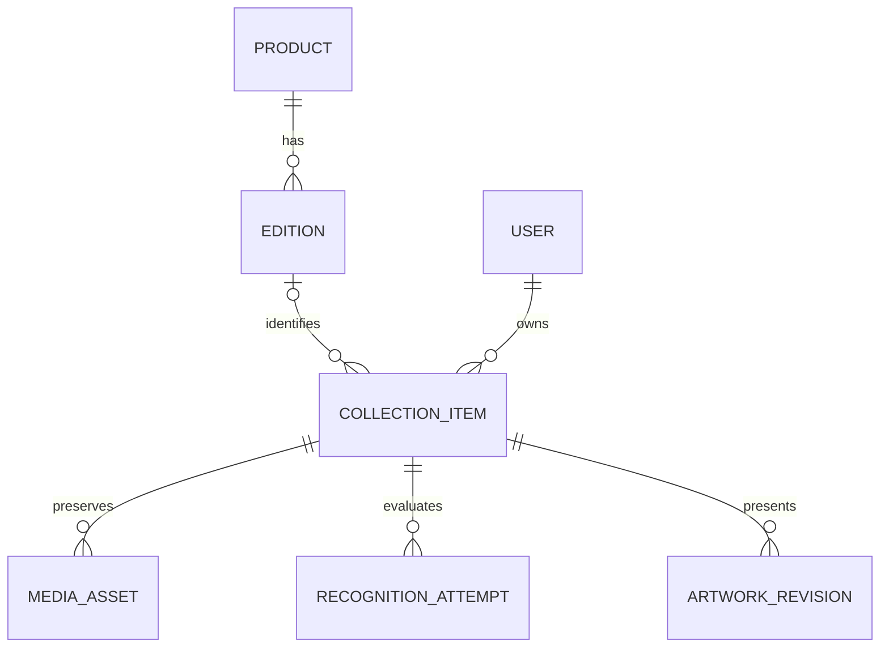
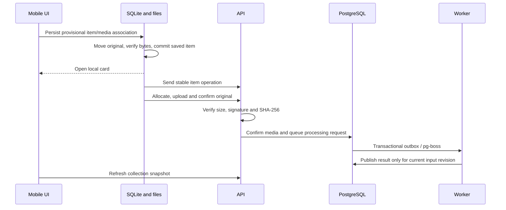

# Architecture

[Documentation](README.md) · Status: implemented prototype with explicit alpha limitations

## Domain boundaries

A **product** describes the drink or snack family. An **edition** describes specific packaging: flavor, market, volume/weight, design, and series where known. A **collection item** is an individual object owned by a user. It can exist without an identified edition.

A missing catalog match means unresolved identification, not rarity. A barcode is a useful attribute, not the identity of a collectible edition. Originals remain independent from recognition and generated presentation.

## Repository and runtime

| Location                 | Responsibility                                                            |
| ------------------------ | ------------------------------------------------------------------------- |
| `apps/mobile`            | Expo/React Native screens, SQLite, permanent files, sync queue            |
| `apps/server`            | NestJS API and worker, database migrations, storage and provider adapters |
| `packages/api-contracts` | Zod request schemas, shared response models and TypeScript types          |
| `scripts`                | Local setup, build, test and cache-cleaning entry points                  |

The backend is a modular monolith. API and worker are separate processes using the same PostgreSQL schema. Redis and separate microservices are not required for this prototype.

## Photo lifecycle

File operations and SQLite cannot share a transaction. A provisional association is written before the file move. Recovery checks interrupted primary captures and additional angles, reconstructs metadata, and avoids duplicate queued operations. An unavailable photo is surfaced as needing attention rather than crashing the whole collection.

## Synchronization

Operations have stable device-generated IDs. A lost response is retried with the same payload. The server stores idempotency records and rejects reuse of an operation ID with incompatible content.

Item updates use `expectedVersion`. When a conflict only reflects unchanged edited fields, the client can retry against the newer version after the explicit rejection. A conflicting user edit stays local and needs resolution; a full conflict UI is not implemented.

The client currently requests a complete snapshot, including deleted items. Pending/error local edits are protected from snapshot replacement. Sync runs in the foreground and on resume; it is not an OS background scheduling guarantee.

## Processing

A processing request is tied to an item input revision and provider configuration. pg-boss enqueue and outbox acknowledgement use the same database transaction. Stale results do not replace presentation for newer inputs.

Default providers use manual identification and the original photo. Optional OpenAI adapters are server-only and require explicit configuration. Provider calls are recorded before external work; a request with an uncertain outcome is not automatically charged again. The daily request cap is a call count, not a currency budget.

The initial AI catalog context is bounded to 1,000 confirmed editions per category. A retrieval index is required before expanding beyond that boundary.

## Storage and access

The local server driver stores originals under `.local/storage` when using the root runner. The optional S3 driver uses private objects and temporary upload URLs. Confirmation checks image signature, declared length and SHA-256; the S3 path validates a pinned staged object before promotion.

Originals are immutable after confirmation. Generated artwork is a separate revision. Account tokens belong in the device secure store; provider/storage credentials stay on the backend.

These mechanisms are implemented, but production deployment controls and a real S3 environment have not yet been validated. See [SECURITY.md](../SECURITY.md).

## Archives

The local backup is tagged `my-collection-local` and includes device metadata and original files, including data not yet synced. It differs from the server export format. Import validates the ZIP directory, manifest relationships and checksums, then preserves existing records and uses stable owner-aware ID mapping.

A single archive is capped at 200 MB; expanded imports are capped at 400 MB. Streaming/multipart backup is future work. Sync is not a substitute for backup.

## Implemented versus planned

Implemented: local persistence and recovery, immutable original confirmation, owner scoping, idempotent operations, optimistic versions, catalog proposals/editor APIs, durable processing, and local/server archives.

Planned: incremental sync, large-collection backup, physical-device acceptance, full conflict resolution, AI quality/cost evaluation, public-service operational hardening, and iOS validation. See the [roadmap](../ROADMAP.md) and [decision records](decisions/README.md).
